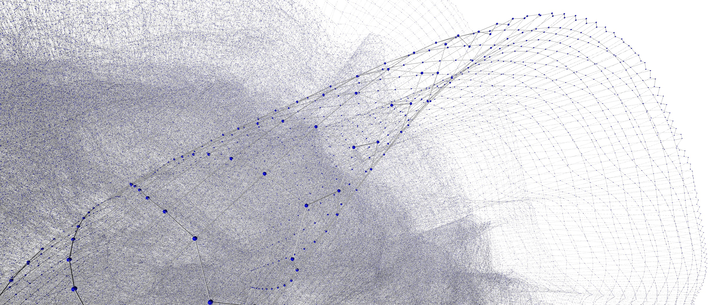

# Public Transport

*Visualization of the graph created by this program using transit data from ./data*

This project can find public transport connections from one stop to another, reading the timetable data from any GTFS archive. It is implemented in under 1k lines of code with zero dependencies (besides Typescript and Jest for testing).

Using the example archive provided in ./data, the resulting graph has 1.2 million vertices with 2.4 million edges. Finding a route between two stops only takes a few milliseconds.

For information on how the time based graphs in this project work, feel free to read the explanation in `graph/timegraph.ts`.

### Limitations:
- No support for off-schedule routes contained in calendar_dates.txt.
- No support for frequencies.txt as it wasn't used by the AVV dataset.
